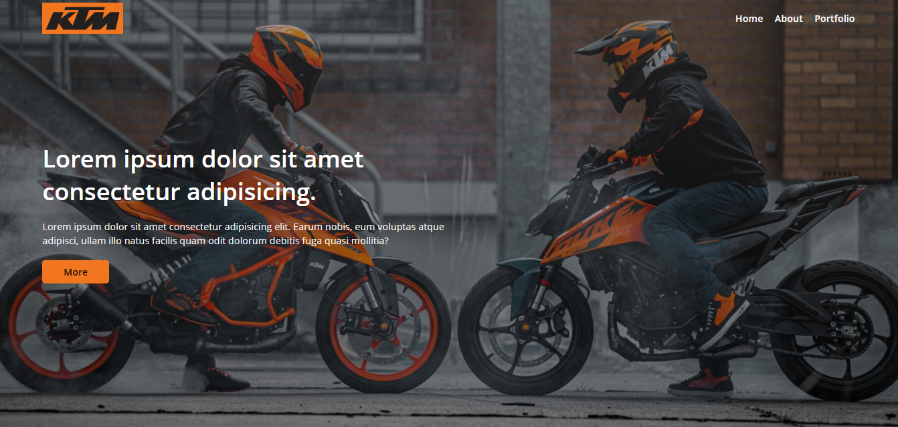
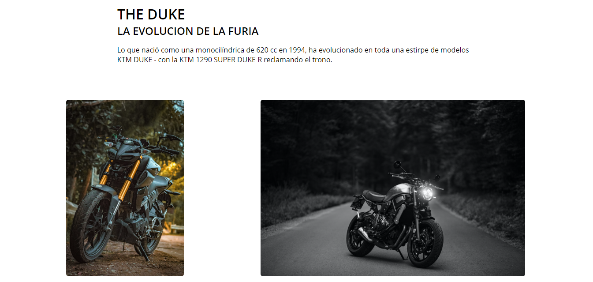
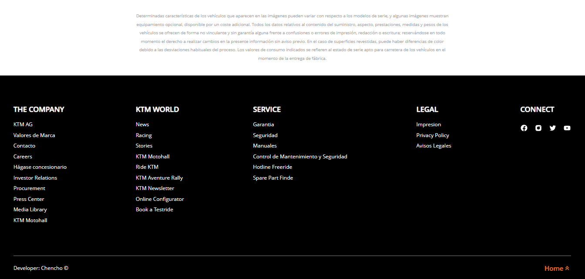

# KTM Web Page

## Project Create With HTML5 & CSS3 (BEM)

In this project, I make use of HTML5 technologies by applying solid semantics to provide a robust structure to the web page. In addition, I use CSS3 with the BEM (Block, Element, Modifier) methodology for stylization through classes, ensuring a visual design consistent and maintainable.

## Description

This project is based on the design concept inspired by the official KTM website, using HTML5 and CSS3 as main technologies. It presents a minimalist and modern interface. The page consists of a hero where a presentation is shown to the user and a gallery of minimalist cards that display the different motorcycles. Additionally, it includes a footer with relevant information and contact details.

## Characteristics

* Minimalist and modern design inspired by the official KTM website.
* Use of HTML5 and CSS3 for the structure and style of the website.
* Hero section for an initial presentation.
* Card gallery showing different motorcycle models.
* Footer with relevant information and contact details.

## Screenshots






## Install
* Clone this repository:

```bash
git clone https://github.com/Chencho34/ktm-web-page
```

## Execute Project:

Open the index.html file in your web browser to view the page. Or run the project with the vscode live server extension.

The page will reload when you make changes.

## Author
Developer: Chencho34

## Implemented technologies.

* HTML5 Semantic structure for a better understanding of the content.
* CSS3 BEM methodology for modular and scalable style.
